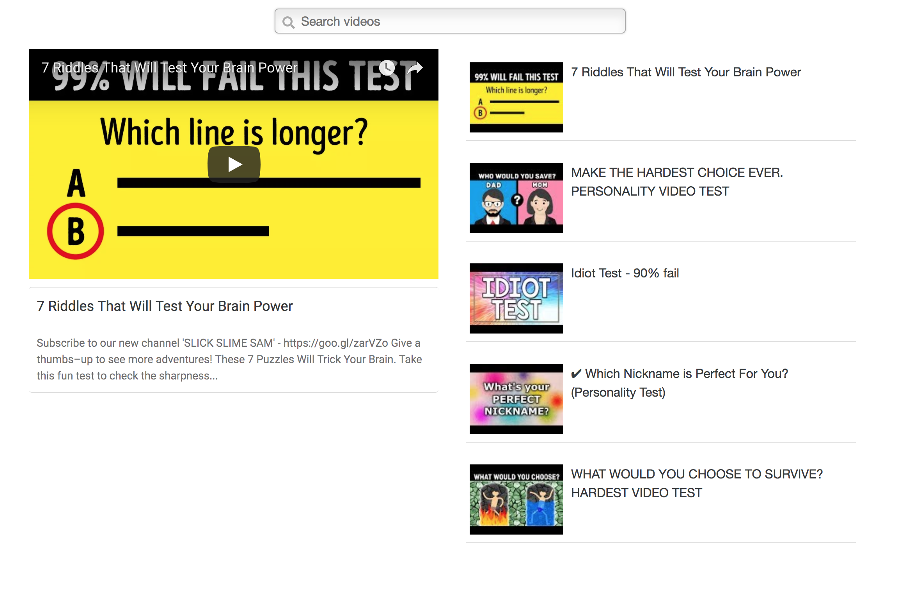

# Youtube Search
Simple React project to search and view Youtube's videos using the [Youtube Data Api](https://developers.google.com/youtube/v3/getting-started?authuser=1)

## Getting Started

These instructions will give you a local copy on your machine which you can then run and use. These steps assumes you have npm installed already. If you do, here is the [installation guide](https://docs.npmjs.com/getting-started/installing-node) to get started.

```
git clone https://github.com/mariesta/YoutubeSearch.git
npm install
npm run dev
```

Look for the line 'Project is running at [localhost url]'. If you navigate to this url, you should see this.



You can then search and view videos as much as you want. Enjoy!

## Acknowledgments

* [Setting up a React project from scratch](https://codeburst.io/setting-up-a-react-project-from-scratch-d62f38ab6d97)
* [Modern React with Redux course](https://www.udemy.com/react-redux/learn/v4/overview)